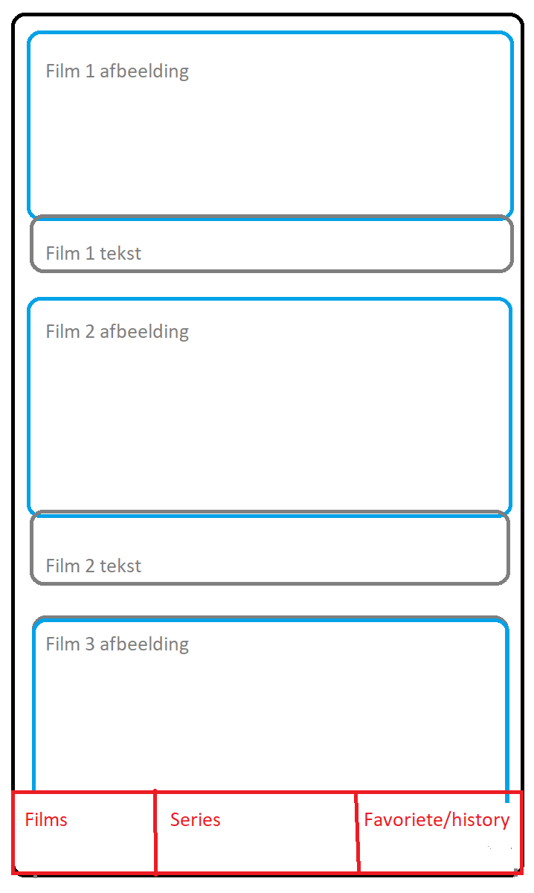

# Projectdoelen - MDE

*gebruik dit markdown bestand om je project te beschrijven en je geplande features aan te duiden.*

## Beschrijving

Beschrijf het doel en werking van je app.
Denk na over volgende zaken:
- wat is het doel van je app?
- welk probleem lost je app op?
- wie zal je app gebruiken?
- hoe zal jouw app gebruikt worden?
- ...

De app die ik zal ontwikellen is een mobile friendly app die films en series aanbiedt.
De gebruiker krijgt films en series te zien, met hun titel en afbeelding. Als erop wordt geklikt krijgt hij alle gegevens te zien zoals: de titel, de genre, de beoordeling etc.
Er zal de mogelijkheid zijn om te sorteren en te filteren met veel verschillende opties.

De app zal de films en hun data verkrijgen van een API, namelijk de yts.mx/api.

## Online strategie

Kruis je online **strategie** aan:

- [ ] Online CRUD operaties met een Backend Service
- [X] Online Fetch, Offline CRUD
- [ ] Offline CRUD, Online Push
- [ ] Online CRUD operaties met eigen REST API
- [ ] Andere, namelijk: 

## Mobile features

Kruis je geplande **mobile features** aan:

- [X] Platformintegraties
      noteer welke: gyroscoop en location.
      
- [X] Push notifications
- [ ] 2D Graphics
- [ ] Authentication en Authorization
- [ ] Native Communication
- [ ] Native Speech to Text
- [ ] Cross-platform Native Plugin
- [ ] Andere, namelijk: 

## Wireframes

Plaats hier de wireframes die je uploadde naar `/reports/wireframes` (gebruik relatieve verwijzingen).

